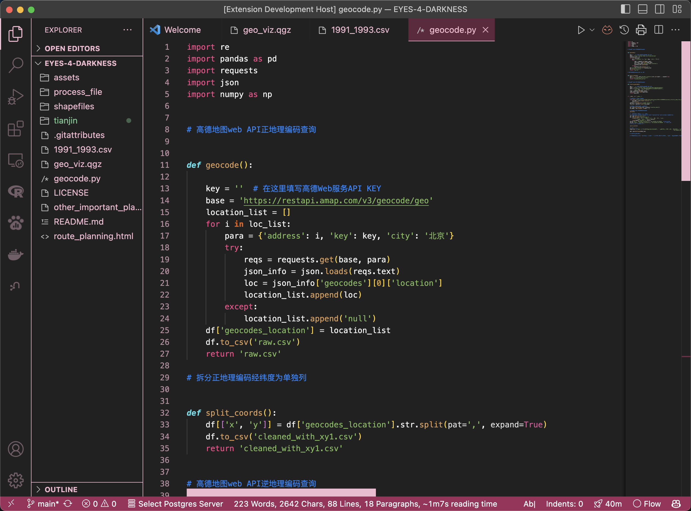

# README

     

**A dark, pink-and-green-ish VS Code color theme extension.**

Preview:

How to use:

1. **(easiest)** search "火龙果"/ "dragon fruit" in vscode extension, and install, and enjoy coding with cute colors!
2. open [marketplace link](https://marketplace.visualstudio.com/items?itemName=drunken-boat.dragon-fruit-tree-top-house) and install.

## helpful resources
Inspired by [fluffy dark theme](https://marketplace.visualstudio.com/items?itemName=ayakoSky.fluffy-dark-theme) and [woody theme](https://github.com/seahyx/Woody-Theme).

[a video tutorial](https://www.youtube.com/watch?v=m6S4NSZkB88&ab_channel=Classsed)

[how to publish extensions](https://code.visualstudio.com/api/working-with-extensions/publishing-extension)

[a color palatte](https://colorhunt.co/)

[a color palatte generator](https://colors.muz.li/)

[color blind friendly](https://davidmathlogic.com/colorblind/#%23D81B60-%231E88E5-%23FFC107-%23004D40)

## updates in version 2.0.0:

fix to increase contrast and readability: 

1. changed selected word highlight color (in editor.wordHighlightBorder and editor.wordHighlightBackground)
2. changed python logical operator color (in keyword.operator.logical.python.foreground)
3. changed the finder background (in editor.findMatchHighlightBackground)
4. changed the comment color and font
5. changed transparency in hover file list
6. changed editor.background and other 11 black color, from #121212 to #212121

## updates version 2.1.3(because I like this number):
color blind friendly changes, comment color, tab highlight, storage.type.